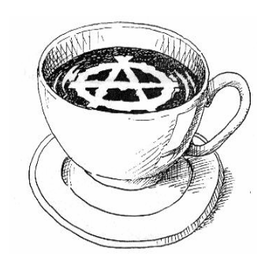
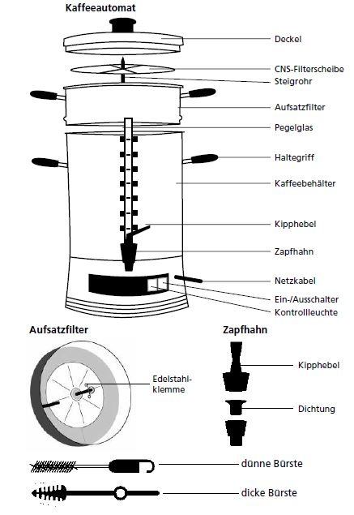

Größere Mengen Kaffee kannst du entweder mit einem Jutebeutel oder mit einer Rundfilterkaffeemaschine kochen. Pro Liter fertigen Kaffee brauchst du etwa 30g gemahlenes Pulver.

## Die Coldbrewmethode

Diese Methode spart eine Menge Gas und Nerven.

1. Mindestens 24h vor Kaffeeausgabe: Das Kaffeepulver (30g pro Liter) zusammen mit kaltem Wasser in dicht haltende Lagerbehälter geben. Wir nutzen dafür üblicherweise lebensmittelechte blaue 30L-Fässer, aber Eimer mit Deckeln gehen auch gut.
 
2. Gut durchrühren, sodass das Pulver nicht trocken verklumpt. Lagerbehälter schließen und an einem kalten Ort mindestens 24 und höchstens 48 Stunden stehen lassen.

3. Kurz vor Kaffeeausgabe: Lagerbehälter durch ein Abseihtuch oder ähnliches abgießen. Falls kein Tuch vorhanden: Das Kaffeepulver setzt sich sehr gut ab; Wird also vorsichtig gegossen ist kein Tuch nötig.

4. Optional: Abgegossenen Kaffee erhitzen. Achtung, er sollte keinesfalls kochen, sondern nur auf 80-85°C erhitzt werden.

Vorteile der Methode sind: 

 - Kann in einem ruhigen Moment vorbereitet werden

 - Kaffee ist sehr stark und kräftig (falls unerwünscht: Auf 20g pro Liter reduzieren)

 - Im Sommer toll, wenn der Kaffee kalt ist

## Die Jutebeutelmethode

Zum Aufbrühen einen sauberen Jutebeutel in einen Behälter (am besten ein Thermobehälter mit Zapfhahn) einhängen,  Kaffeepulver und eine kleine Prise Salz in den Beutel geben und nach und nach (wie zuhause mit Kaffeefilter) kochendes (wirklich sprudelnd kochendes!) Wasser durch den noch offenen Beutel gießen.
Der Beutel sollte danach im Wasser hängen.

Nach circa zehn Minuten den Beutel mit Satz herausnehmen und aufhängen. Wenn es schön abgetropft ist, lässt sich der Satz besser aus dem Beutel kippen.

Achtung: Den Beutel nicht wie ein Teebeutel zuknoten! 
Wenn du das machst geht die Luft nicht raus, der Beutel schwimmt oben, der Kaffe verklumpt und nur die äußerste Seite vom Kaffeklumpen hat Kontakt mit dem Wasser.

## Mit der Rundfilterkaffeemaschine

1. Den Wasserbehälter mindestens zur Hälfte befüllen.
2. Den Filteraufsatz einsetzen.
3. Jetzt kommt gemahlener Kaffee in den Filter.
4. Anschalten.

Je nach Maschine und Außentemparatur dauert es etwa 30-40 Minuten bis der Kaffee fertig ist. 
Durch Entnahme einer kleinen Menge am Zapfhahn einfach abschmecken.

